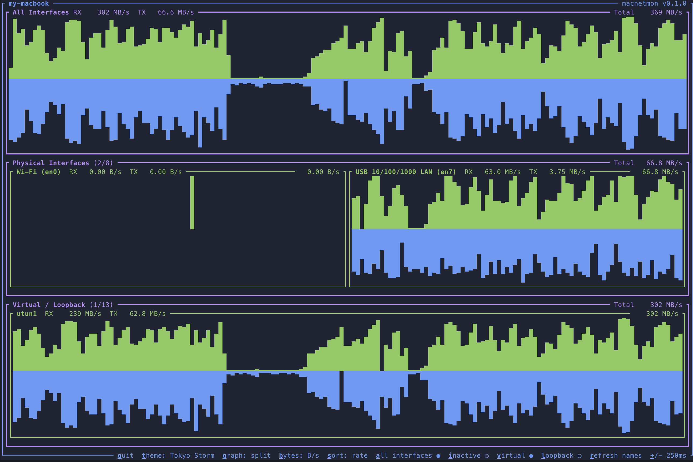
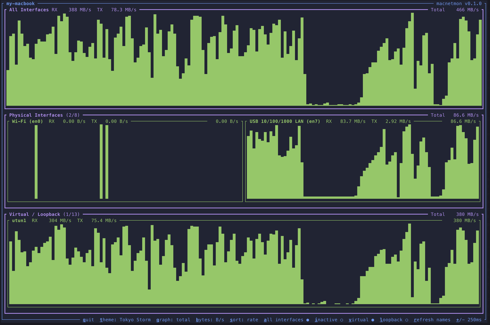

<div align="center">

# macnetmon

Network interface bandwidth monitor for macOS

[](https://github.com/mdsakalu/macnetmon/actions)
[](https://github.com/mdsakalu/macnetmon/releases/latest)
[](https://crates.io/crates/macnetmon)
[](https://github.com/mdsakalu/macnetmon/releases)
[](https://github.com/mdsakalu/homebrew-tap)

[](https://www.rust-lang.org)
[](https://www.apple.com/macos)
[](LICENSE)
[](https://ratatui.rs/)





</div>

## About

macnetmon is a TUI (Terminal User Interface) application that displays real-time network interface bandwidth usage on macOS. It monitors incoming (RX) and outgoing (TX) traffic rates for all network interfaces with colorful visualizations.

Inspired by [macmon](https://github.com/vladkens/macmon), which monitors Apple Silicon power consumption.

## Features

- Real-time network bandwidth monitoring
- Split sparkline visualization for RX/TX traffic
- Multiple color themes (7 solid colors + 10 advanced themes including Catppuccin, Dracula, Nord, Tokyo Night)
- Friendly interface names from macOS `networksetup`
- Toggle display of loopback, virtual, and inactive interfaces
- Sort by bandwidth or interface name
- Overview panel showing total system bandwidth
- Bits/s and Bytes/s display modes
- Persists settings (theme, toggles, interval) across runs
- 512-sample history depth

## Installation

### Homebrew

```sh
brew install mdsakalu/tap/macnetmon
```

### Cargo

```sh
cargo install macnetmon
```

### Build from Source

```sh
git clone https://github.com/mdsakalu/macnetmon.git
cd macnetmon
cargo build --release
./target/release/macnetmon
```

## Usage

```sh
macnetmon [OPTIONS]
```

### Options

| Option                | Description                                     |
| --------------------- | ----------------------------------------------- |
| `-i, --interval <MS>` | Update interval in milliseconds                 |
| `--hide-loopback`     | Hide loopback interfaces                        |
| `--hide-virtual`      | Hide virtual interfaces                         |
| `--show-inactive`     | Show inactive interfaces                        |
| `--bits`              | Display in bits/s instead of bytes/s            |
| `-h, --help`          | Print help                                      |
| `-V, --version`       | Print version                                   |

### Keyboard Controls

| Key | Action                         |
| --- | ------------------------------ |
| `q` | Quit                           |
| `t` | Cycle through themes           |
| `g` | Toggle graph (split/total)     |
| `b` | Toggle bits/bytes display      |
| `s` | Toggle sort (bandwidth/name)   |
| `a` | Toggle “All Interfaces” panel  |
| `i` | Toggle inactive interfaces     |
| `v` | Toggle virtual interfaces      |
| `l` | Toggle loopback interfaces     |
| `r` | Refresh interface aliases      |
| `+` | Increase refresh interval      |
| `-` | Decrease refresh interval      |

## Configuration

macnetmon persists settings to:

```
~/.config/macnetmon.json
```

CLI flags override saved settings for that run, and the updated values are saved back to the config.

Default interval is 1000ms if no config exists.

## Requirements

- macOS (uses macOS-specific APIs via libc)
- Rust 1.70+ (for building from source)

## Contributing

Contributions are welcome! Whether you have ideas, suggestions, or bug reports, feel free to [open an issue](https://github.com/mdsakalu/macnetmon/issues) or submit a pull request.

## License

[MIT](LICENSE)

## See Also

- [macmon](https://github.com/vladkens/macmon) - Apple Silicon power monitor (inspiration for this project)
